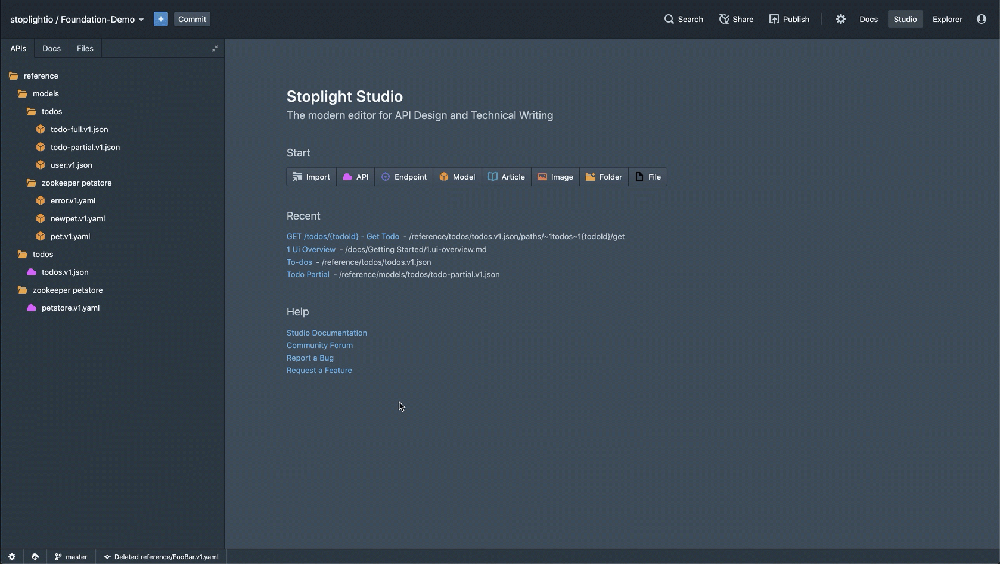
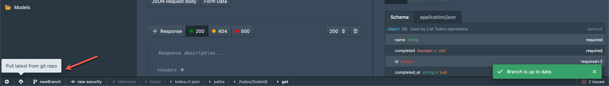

# Introduction

Welcome to this beginner lab for Stoplight Studio.

This workshop will focus on using Studio to write `OpenAPI` files, models (schemas), markdown articles. We also cover adding `Spectral` and configuration files to provide a full understanding of Studio's functionality.

### Training Environment

To complete this workshop you need access to Stoplight Studio in your browser, provided by a [Stoplight workspace](https://stoplight.io/welcome/create) or you can download the [Studio application](https://stoplight.io/studio/) to your desktop or laptop.

### Git

Stoplight Studio is a powerful git client that allows users to leverage version control to power their API designs. This approach provides greater collaboration, reviews and gives your team full ownership of the source of truth for your design documents. 

As a result there are a few key features that you should be aware of:

#### Branches

Studio can checkout existing git branches and create new branches as you are working with your API designs and documentation.

#### Push

Studio can push your changes to new or existing branches on your source control. You can also compare changes and add commit messages when you push a change.

#### Pull

To get the latest update from your repository, click on the button called '*Pull latest from git repo*'.

### Tabs

Studio will also organize your repository into functional tabs to make your work easier. 

#### APIs
If you are focused on API design, the 'APIs' tab will only display OpenAPI and model files.

#### Docs
If you are writing behavioral documentation, the 'Docs' tab will display markdown files and other assets such as images.

#### Files
The 'Files' tab will display all files and directories located in your repository in case you need them.
