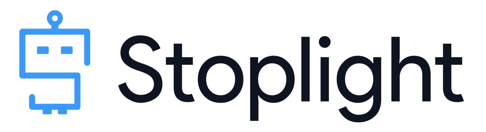

# Introduction

Welcome to the beginner lab for Stoplight Studio.

This workshop will focus on using Studio to write `OpenAPI` files, models (schemas) and markdown articles. We also cover adding `Spectral` and configuration files to provide a full understanding of Studio's functionality.

This lab provides a `starter` branch which you will use to complete the exercises. It also contains a `final` branch that serves as a reference for what the end result will look like. 

To learn more about how branches work, checkout the next section called '**Training Environment**'.

<!-- theme: info -->

> ### Getting Started
>
> *Begin the lab by becoming familiar with the **Training Environment** and the **Stoplight Studio UI**.* 
>
>*Then proceed to complete each subsequent step until you have produced a final project.*