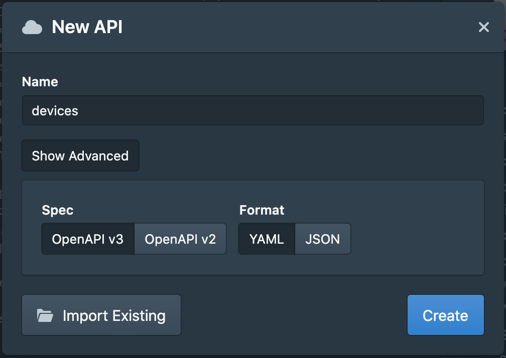
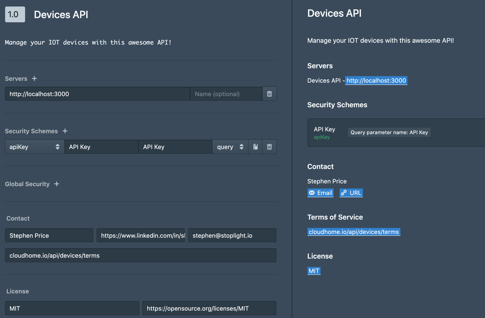
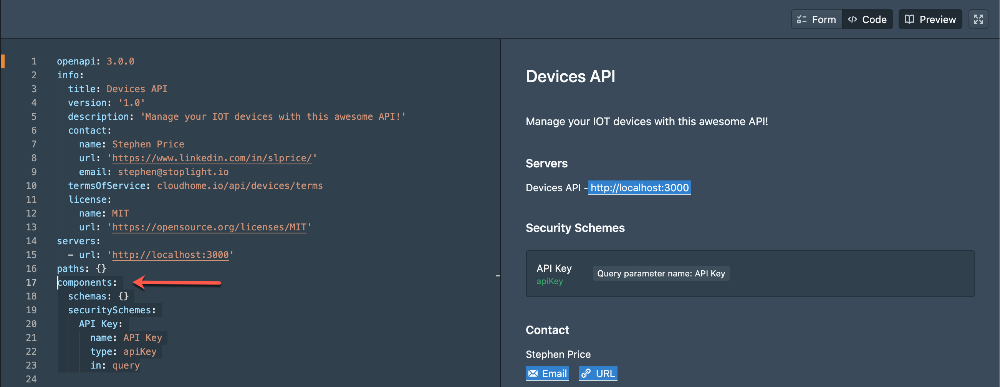
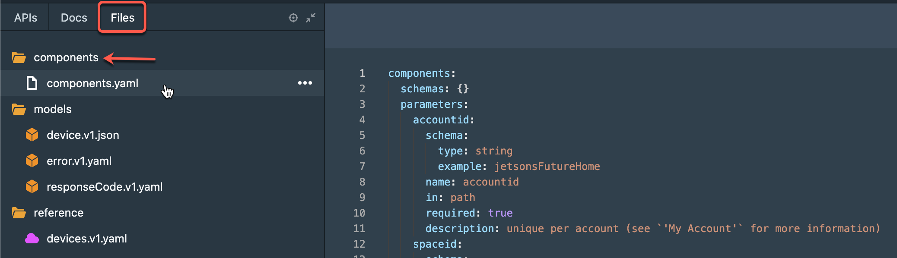

# Create an API

You will notice that your APIs tab is pretty empty besides a few model files we provided to you. Let's change that!

<!-- theme: warning -->

> ### Use the Starter Branch!
>
> _Make sure that you are using the right branch to complete the exercises._

### Add an OAS file

Start by adding a new API by clicking on the blue plus `(+)` icon on the top left of the UI.

Create an API called 'devices', using `OpenAPI v3` and `YAML` format.

### API Overview

Once you add the devices API file, you will be presented with an empty overview page. Use the form editor to do the following:

- [ ] Write a neat **Description** (right below the **Title**).
- [ ] Add an API token in **Security Schemes** to secure your operations.
- [ ] Add **Contact** information so your docs consumers know who to talk to.
- [ ] Include licensing information so users know how you **License** your API.

### Shared Components

To end this section you will need to add a set of parameters to the components section of your `devices.v1.yaml` file. To do so change the view from `form` to `code` and look at the underlying yaml for your API description.

Notice the arrow indicating a section called `components` which contains schemas and security schemes. We will want to add a few parameters to this section as we will reuse them through out the document.

Next go to the 'Files' tab and open the 'components' folder. Select the `components.yaml` file to display a set of parameters.

