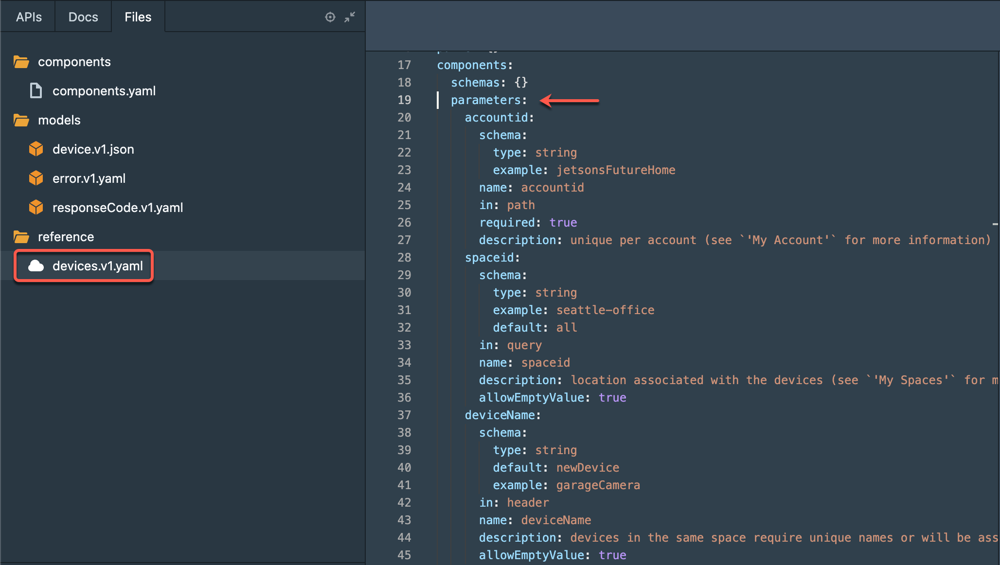

# Create an API

You will notice that your APIs tab is pretty empty besides a few model files we provided to you. Let's change that!

<!-- theme: warning -->

> ### Create your own Branch!
>
> _Make sure that you first checkout the `starter` branch but then create a new branch to complete the exercises. Call it whatever you want!_

### Add an OAS file

Start by adding a new API by clicking on the blue plus `(+)` icon on the top left of the UI.

Create an API called 'devices', using `OpenAPI v3` and `YAML` format.

### API Overview

Once you add the devices API file, you will be presented with an empty overview page. Use the form editor to do the following:

- [x] Write a neat **Description** (right below the **Title**).
- [x] Add an API token in **Security Schemes** to secure your methods.
- [x] Add **Contact** information so your docs consumers know who to talk to.
- [x] Include licensing information so users know how you **License** your API.

<!-- theme: info -->

> ### Pro Tip...
>
> *Now would be a great time to push changes to your new branch to make sure that your progress is saved.*

### Reusable Parameters

To end this section you will need to add a set of parameters to the components section of your `devices.v1.yaml` file. To do so change the view from `form` to `code` and look at the underlying yaml for your API description.

Notice the arrow indicating a section called `components` which contains schemas and security schemes. We will want to add a few parameters to this section as we will reuse them through out the document.

Next go to the 'Files' tab and open the 'components' folder. Select the `components.yaml` file to display a set of parameters. 

Copy the contents of this file and return to your `devices.v1.yaml` file. 

Paste these contents right below `schemas: {}` and above `securitySchemes:` as shown here:

<!-- theme: warning -->

> ### Security Schemes
>
> _Before proceeding to the next step make sure that you did not delete the _`securitySchemes:`_ object by mistake! Studio will warn you if your yaml file is invalid._

<!-- theme: success -->

> ### Well Done!
>
>*Once you are done with this section you will need to create a few more models to use as request and response bodies for your endpoints. Continue to the section called '**Models**'.*
