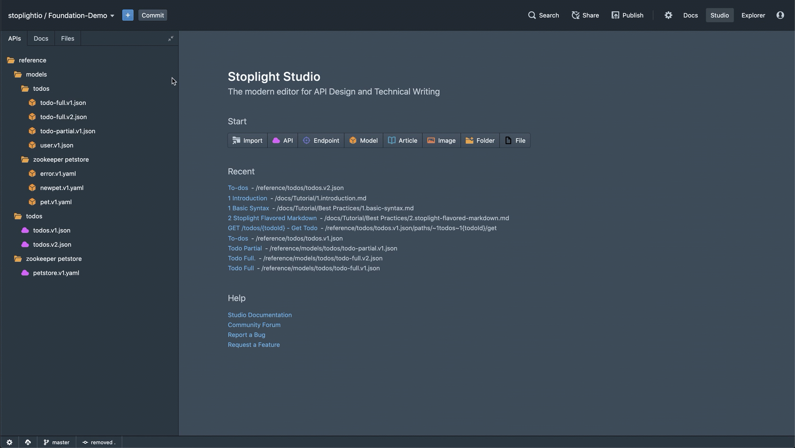
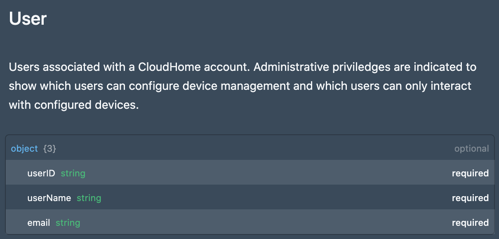
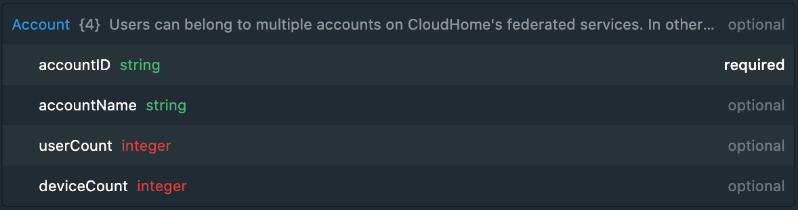
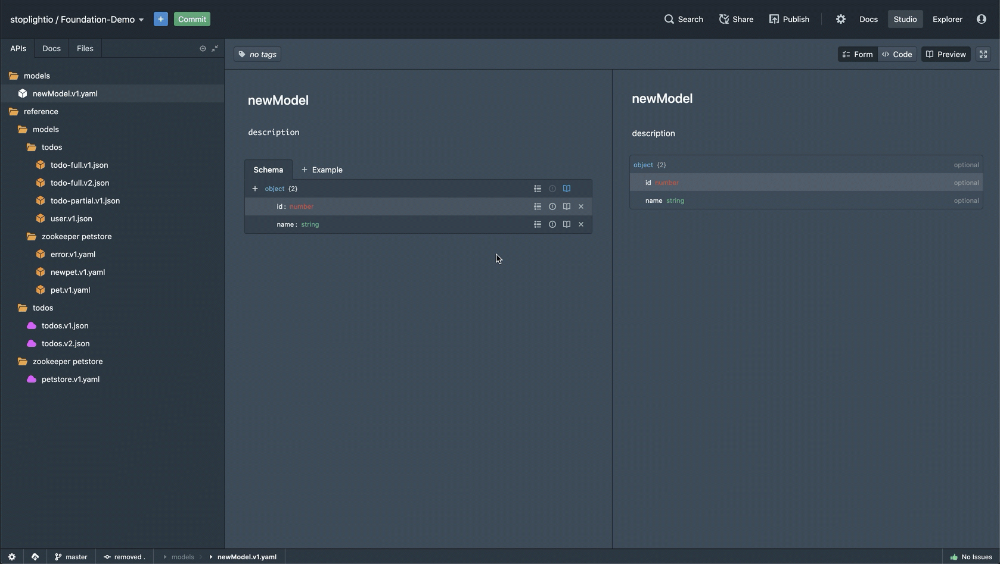
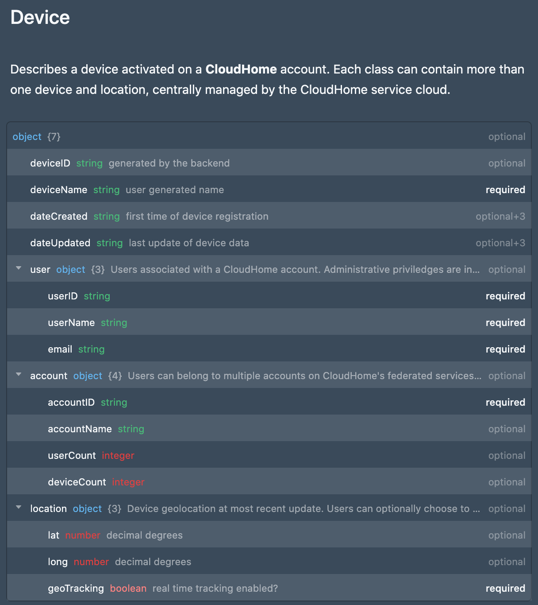
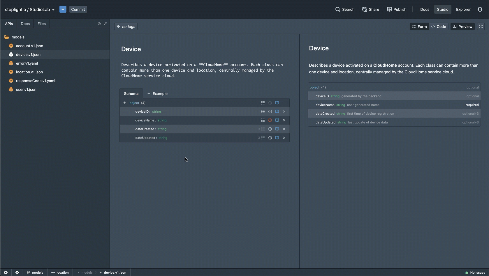

# Models

### Add JSON Models
Create stand alone `JSON` files for the following user, account and location models. This example gif demonstrates how to add a new model file.

<!-- theme: warning -->
> ### Use the Common scope & JSON format
>*That way your models will be created as independent *`JSON`* files rather than written inline in the *`OAS`* file.*

### User
**Description**: *Users associated with a CloudHome account. Administrative priviledges are indicated to show which users can configure device management and which users can only interact with configured devices.*

### Account
**Description**: *Users can belong to multiple accounts on CloudHome's federated services. In other words users have a unique id that can interact or manage devices on more than one account or location.*

### Location
**Description**: *Device geolocation at most recent update. Users can optionally choose to turn off geolocation, however key features such as mapping will not be available.*

<!-- theme: info -->

> ### A thing to know...
>
> *If you wish to add descriptions or additional validation to your fields you can do so as demonstrated in the following example.*

## 2. Add References to the New Models
Select the `device.v1.json` model and add references (`$ref`) to the new models you added in the previous step. This will create a complete representation of the schema used to manage devices. 

In other words, within the `device.v1.json` model, add references to the `user.v1.yaml`, `account.v1.yaml` and `location.v1.yaml` files.

The following example demonstrates how to add references (`$ref`) to a model:

