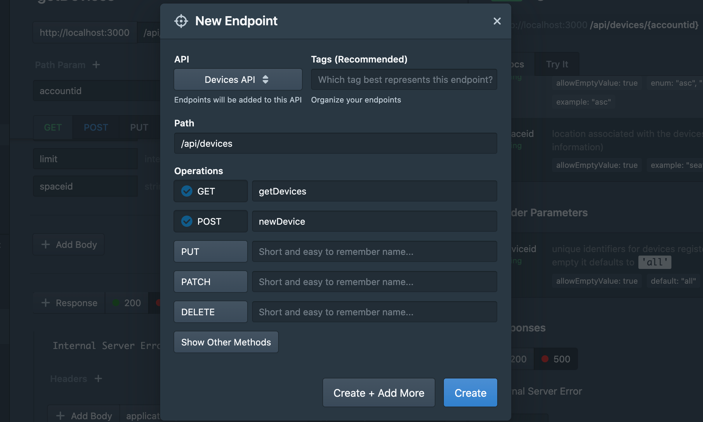
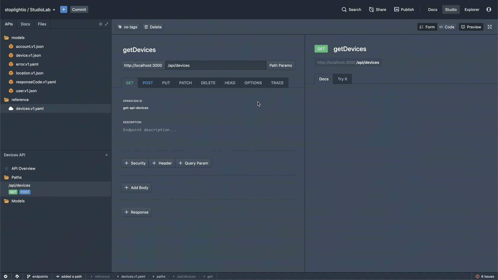
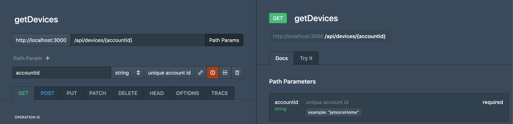
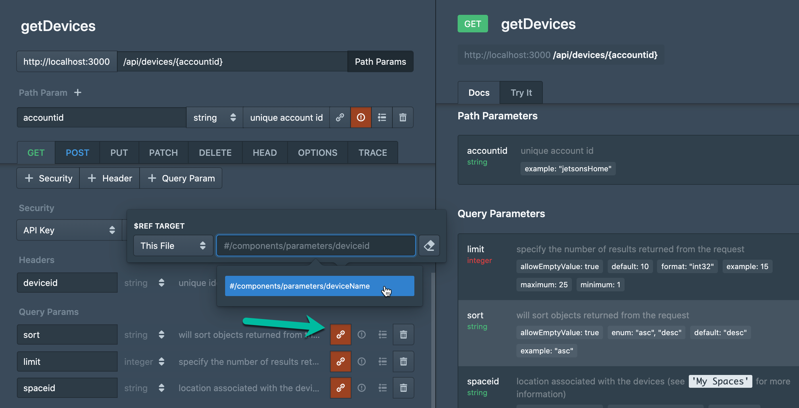

# Endpoints

The next step is to add `endpoints` to your API. To do so, click on the blue 'plus' icon (`+`) on the top left of the UI and select '**Endpoint**'.

You will then be presented with this window to add a `path` and `endpoints` to your API:

Select the '**Devices API**' and add the following path: `/api/devices`.

Next add a `GET` and a `POST` operation, naming them accordingly. Finish by clicking on '**Create**'.

## Describe your Endpoints

The `endpoints` need descriptions, parameters, request and response bodies in order to be useful. Let's start with the `GET` operation.

### Path Parameters

Add a `path parameter` called '**accountid**' with a simple description and an sample value. This parameter is being written inline for the entire path and will be shared with the `POST` operation.

The parameter should look like this:

<!-- theme: info -->

> ### All you need is an extra push...
>
> *Don't forget to frequently push changes to your git branch to make sure that you save your progress.*

### Header and Query Parameters

Next you will add `Header` and `Query` parameters as well as an API token to secure your endpoint. This time we will use references (`$ref`) like you did with models. This way you reuse components rather than define everytime you need them.

Click on '**+ Security**' to add the API key defined in the API overview. Likewise click on '**+ Header**' to add a `header` parameter called '**deviceid**'. You will notice that you can reference components using paths such as this:

`#/components/parameters/deviceid`

This indicates that you are reusing a parameter from the components section you had copy/pasted earlier. The following image shows what this looks like and the green arrow indicates the button that allows users to use a reference.

Click on '**+ Query Param**' to add the query parameters '**sort**', '**limit**' and '**spaceid**'.

This example demonstrates how to accomplish this step:

