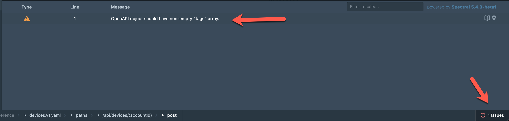
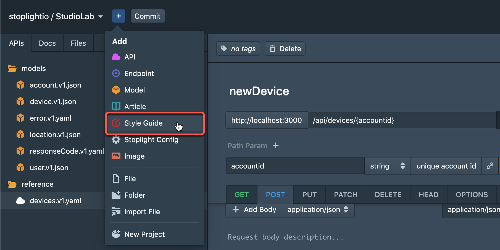
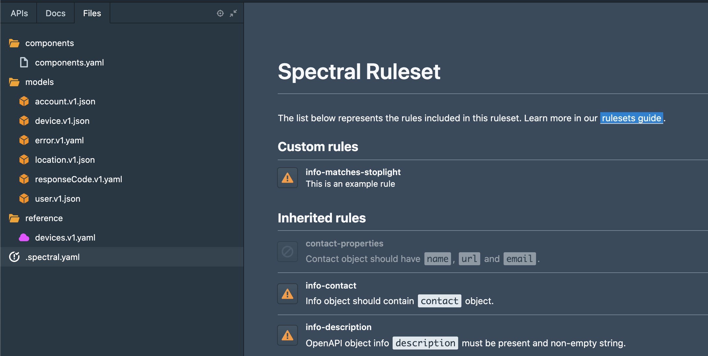
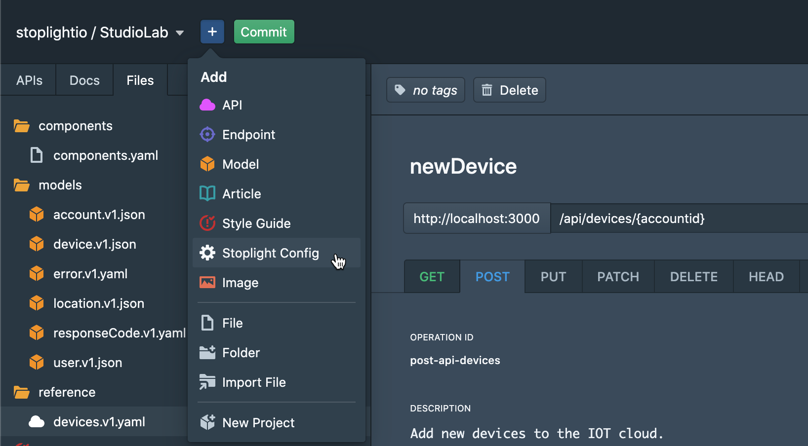
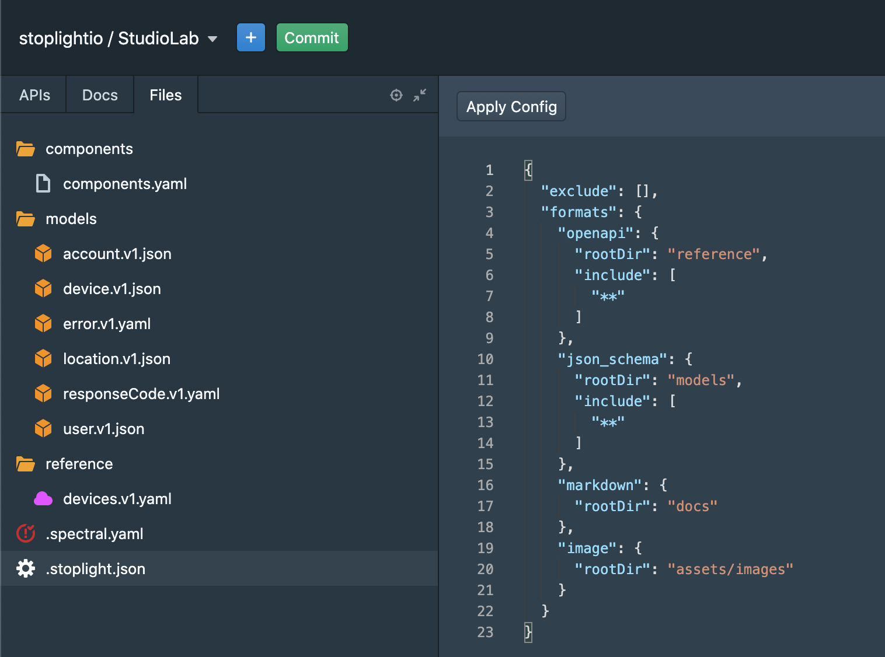

# Advanced Topics

**Stoplight Studio** simplifies the API design process and jumpstarts a consistent design-first practice across your team.

Beside the topics we covered earlier there are a few useful topics that are useful for both beginners and users who are already familiar with **Studio**.

## Style Guides

You may have noticed the useful indicator letting you know if you have made a mistake or providing suggestions to improve your design document:

**Stoplight Studio** ships with out-of-the-box `OpenAPI` best practices. This guidance and validation is provided by **Stoplight**'s open source [**Spectral**](https://stoplight.io/open-source/spectral/) product.

In addition to the default `OpenAPI` ruleset provided by **Studio**, **Spectral** can also enforce your own custom rules - allowing your organization to define it's own **styleguides**.

To enforce custom rules in **Studio**, add a **styleguide** file.

You will find the styleguide file (`spectral.yaml` or `spectral.json`) under the '**Files**' tab. The form view presents an interface to customize which rules you wish to enforce. 

To write a custom rule, use the code view. To learn more about writing custom rules we suggest that you read the documentation for [**Spectral**](https://stoplight.io/open-source/spectral/).

## Configuration File

Sometimes your API descriptions will be colocated with your codebase. This may happen for a number of reasons but usually as a result you will have multiple API files that you do not wish to document, such as outputs from `SDKs` and other processes performed with your code.

The **Stoplight Config** file let's you customize which folders will be used by **Studio** and published as documentation.

For example you can use the exclude argument to ignore certain folders that will not be needed for API design and documentation.

