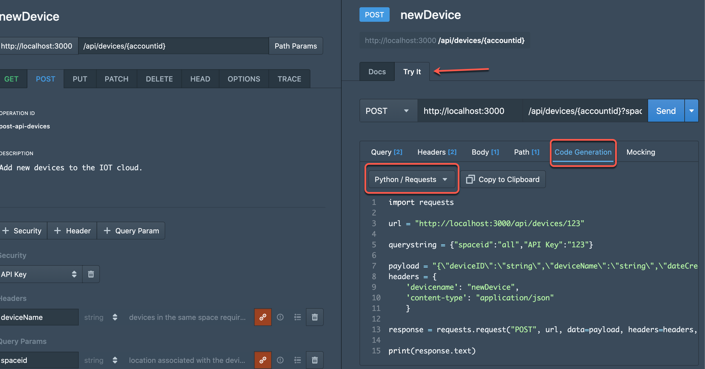
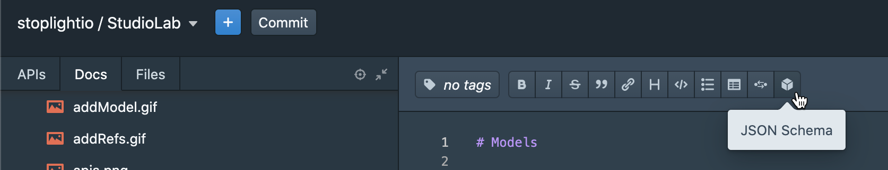

# Markdown

Often you will find the need to complement OpenAPI descriptions of your APIs with additional articles that provide additional explanations, instructions and description's of use cases. This type of content can greatly increase adoption of your services and are very important for anyone wishing to expose APIs to third parties or customers.

This is also a great opportunity to include a Technical Writer into your API documentation effort!

**Stoplight Studio** can author these types of documents via markdown, a format that is approachable and easy to use, yet powerful. In addition to the common content blocks you will commonly find with markdown, **Studio** can produce API specific content such as the examples below.

<!-- theme: info -->

> ### Pro Tip...
>
> *To generate the code samples and the embedded request maker you will find below you can use the **Request Maker** found under the '**Try It!**' tab of the preview in **Studio**. Use the '**codegen**' section to output code samples in multiple languages, including '**Stoplight Markdown**' which will configure a **Request Maker** than you can embed in markdown articles.*



### Code Generation

**CloudHome**'s API documentation provides code generation to get your project started as soon as you imagine it!

```javascript
var data = null;

var xhr = new XMLHttpRequest();
xhr.withCredentials = true;

xhr.addEventListener("readystatechange", function () {
  if (this.readyState === this.DONE) {
    console.log(this.responseText);
  }
});

xhr.open("GET", "https://cloudhome.io/api/devices/123?spaceid=all&sort=desc&limit=10");
xhr.setRequestHeader("deviceid", "all");
xhr.setRequestHeader("apikey", "123");

xhr.send(data);
```
> __*CloudHome*__ is the world's best device management and home automation solution. Our `API`s are just as great as our user-friendly UI, making us the first choice for systems integrators around the world. Bring the power of IOT to your life with __*CloudHome*__.

### Interactive Documentation

With the `'Try It!'` functionality you can send requests directly to our servers provided that you have a valid account and **CloudHome Key**, if you are not an existing customer you can use the built-in mock server for free! Click `'Send'` in the embedded _**Request Maker**_ below to get a sample mocked response:

```json http
{
  "method": "get",
  "url": "https://apiguild.stoplight.io/mocks/apiguild/cloudhome/30785/api/devices/123",
  "query": {
    "spaceid": "all",
    "sort": "desc",
    "limit": "10"
  },
  "headers": {
    "deviceid": "all",
    "apiKey": "123",
    "Prefer": "code=200, example=device"
  }
}
```
<!-- theme: info -->

> ### Pro Tip...
>
> *Copy and paste your schemas into schema blocks in Markdown as seen below.*



### Data Models

If you want to learn more about the data models used by our `APIs`, you can find them at the bottom of the left-hand navigation. Here is an example:
</br>

```json json_schema
{
  "title": "Device",
  "type": "object",
  "x-tags": [
    "devices",
    "IOT"
  ],
  "description": "Describes a device activated on a **CloudHome** account. Each class can contain more than one device and location, centrally managed by the CloudHome service cloud.",
  "x-examples": {
    "devices": [
      {
        "deviceID": "123",
        "deviceName": "frontDoorLock",
        "deviceClass": "safety",
        "spaceID": "home",
        "alexaCompatible": true,
        "storageUsed": 0.003,
        "storageFree": 1
      },
      {
        "deviceID": "456",
        "deviceName": "thermostat",
        "deviceClass": "comfort",
        "spaceID": "home",
        "alexaCompatible": true,
        "storageUsed": 0.025,
        "storageFree": 1
      },
      {
        "deviceID": "789",
        "deviceName": "sprinkler",
        "deviceClass": "convenience",
        "spaceID": "yard",
        "alexaCompatible": false,
        "storageUsed": 0.0018,
        "storageFree": 1
      }
    ],
    "device": [
      {
        "deviceID": "abc",
        "deviceName": "welcomeDroid",
        "deviceClass": "commercial",
        "spaceID": "office",
        "alexaCompatible": true,
        "storageUsed": 137,
        "storageFree": 300
      }
    ]
  },
  "properties": {
    "deviceID": {
      "type": "string",
      "description": "generated by the backend"
    },
    "deviceName": {
      "type": "string",
      "description": "user generated name"
    },
    "deviceClass": {
      "type": "string"
    },
    "spaceID": {
      "type": "string"
    },
    "alexaCompatible": {
      "type": "boolean"
    },
    "storageUsed": {
      "type": "number",
      "description": "in gigabytes as described in this [data measurement chart](http://www.wu.ece.ufl.edu/links/dataRate/DataMeasurementChart.html)\n"
    },
    "storageFree": {
      "type": "number",
      "description": "in gigabytes as described in this [data measurement chart](http://www.wu.ece.ufl.edu/links/dataRate/DataMeasurementChart.html)"
    },
    "dateCreated": {
      "type": "string",
      "format": "date-time",
      "example": "2017-07-21T17:32:28Z",
      "pattern": "/^(?<fullyear>\\d{4})-(?<month>0[1-9]|1[0-2])-(?<mday>0[1-9]|[12][0-9]|3[01])T(?<hour>[01][0-9]|2[0-3]):(?<minute>[0-5][0-9]):(?<second>[0-5][0-9]|60)(?<secfrac>\\.[0-9]+)?(Z|(\\+|-)(?<offset_hour>[01][0-9]|2[0-3]):(?<offset_minute>[0-5][0-9]))$/i"
    },
    "dateUpdated": {
      "type": "string",
      "format": "date-time",
      "pattern": "/^(?<fullyear>\\d{4})-(?<month>0[1-9]|1[0-2])-(?<mday>0[1-9]|[12][0-9]|3[01])T(?<hour>[01][0-9]|2[0-3]):(?<minute>[0-5][0-9]):(?<second>[0-5][0-9]|60)(?<secfrac>\\.[0-9]+)?(Z|(\\+|-)(?<offset_hour>[01][0-9]|2[0-3]):(?<offset_minute>[0-5][0-9]))$/i",
      "example": "2017-07-21T17:32:28Z"
    }
  },
  "required": [
    "deviceName"
  ]
}
```